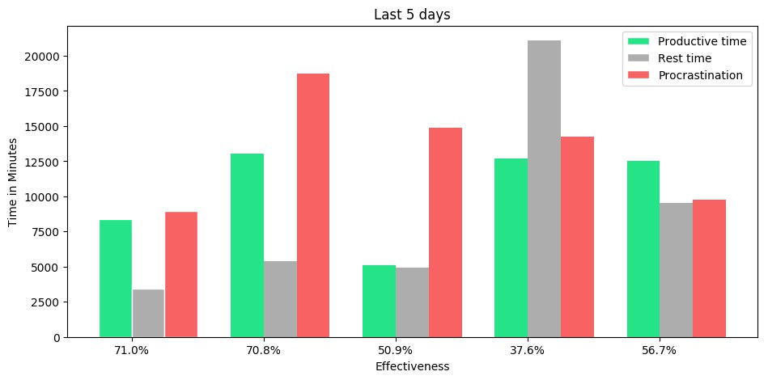

## TimeDeltaBot

You can test it here: [t.me/TimeDeltaBot](https://t.me/TimeDeltaBot)

This bot helps to track time spent on some tasks.

<table>
    <tr>
        <td></td>
        <td></td>
    </tr>
    <tr>
        <td></td>
        <td></td>
    </tr>
    <tr>
        <td></td>
    </tr>
</table>
